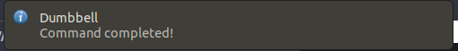

# dumbbell

https://www.npmjs.com/package/dumbbell

Do a bell :bell: after a dumb :black_joker:

## Install

`npm i -g dumbbell`

or

`yarn global add dumbbell`

## Usage

Use it as acknowledgement after a long process ends for you!

Examples:

- `make && bell`
- `yarn install && bell`
- `apt upgrade && bell`
- `./anaconda.sh && bell`

Dumbbell will notify you when it is done!